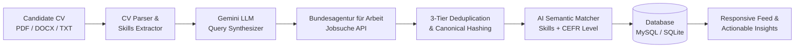

# Jobvis 🎯

[](https://www.python.org/)
[](https://fastapi.tiangolo.com/)
[](https://ai.google.dev/)
[](https://www.sqlalchemy.org/)
[](https://www.docker.com/)
[](https://docs.pytest.org/)
[](https://astral.sh/ruff)

> **Production-grade, AI-driven job discovery & semantic matching engine designed for Jobcenter clients and jobseekers in Germany.**

Jobvis bridges the gap between complex bureaucratic job systems and international or local candidates. It automatically ingests candidate CVs (PDF, DOCX, TXT), uses LLMs to synthesize targeted German search parameters for the official **Bundesagentur für Arbeit (BA)** API, strips duplicate postings through a 3-tier normalization engine, and delivers explainable, AI-scored recommendations tailored to skills, commute preferences, and CEFR language proficiencies.

---

## 🚀 Key Highlights & Engineering Features

- **🧠 Intelligent Query Synthesis & Match Scoring**: Uses Google Gemini via LangChain to translate free-form career goals and multilingual CVs into optimal German job keywords (`was`, `wo`, `arbeitszeit`), evaluating match affinity against CEFR German levels (A1–C2) with explainable rationales.
- **📄 Resilient Multi-Format CV Parser**: Streams and sanitizes content from PDF, DOCX, and TXT documents with control character filtering, size validation, and multi-language skill taxonomy extraction.
- **🛡️ 3-Tier Job Deduplication Engine**: Normalizes German gender markers (e.g., `(m/w/d)`, `[gn]`), strips umlauts, computes canonical hashes, and executes fuzzy similarity comparisons to discard duplicate listings across external postings.
- **⚡ Async Bundesagentur für Arbeit Client**: Non-blocking REST client with connection pooling, exponential backoff, rate-limit protection (HTTP 429), and automatic multi-page scraping.
- **⏰ Autonomous Background Matching**: Twice-daily APScheduler cron automation (`06:00` & `18:00` UTC) with concurrent user-level isolation locks to keep candidate feeds fresh without manual intervention.
- **🌍 Quad-Lingual UI**: Native, zero-reload internationalization across German (`de`), English (`en`), Ukrainian (`uk`), and Russian (`ru`).
- **🔐 Enterprise Authentication**: OAuth 2.0 (Google & GitHub) with automatic account linking and tamper-proof, cryptographically signed session cookies via `itsdangerous`.
- **📦 Production-Ready Architecture**: Multi-stage, non-root Docker build, MySQL 8.4 persistence with healthcheck dependencies, and Sentry error tracking with automatic PII redaction.

---

## 🏗️ System Architecture



---

## 🛠️ Technology Stack

| Layer | Technologies |
|---|---|
| **Core Framework** | Python 3.12+, FastAPI, Pydantic V2 / Settings, Uvicorn |
| **Artificial Intelligence** | Google Gemini (`gemma-4-31b-it`), LangChain Google GenAI |
| **Persistence & ORM** | SQLAlchemy 2.0 (Async), MySQL 8.4 (`aiomysql`), SQLite (`aiosqlite`) |
| **Document Processing** | `pypdf`, `python-docx` |
| **Background Tasks** | APScheduler (AsyncIOScheduler with Cron triggers) |
| **Authentication & Security** | OAuth 2.0 (Authlib, Google, GitHub), `itsdangerous` signed cookies |
| **Frontend & UI** | Jinja2 Templates, Mobile-First Responsive CSS, Multilingual i18n |
| **DevOps & Monitoring** | Multi-stage Docker, Docker Compose, Sentry SDK, Pre-commit, Ruff |

---

## 🏁 Quick Start

### 1. Clone & Setup Environment

```bash
git clone https://github.com/metimol/Jobvis.git
cd Jobvis
cp .env.example .env
```

Edit `.env` and provide your credentials:

```ini
# AI Model
GOOGLE_API_KEY=your_google_genai_key_here

# OAuth 2.0 (Optional for local testing if mocked)
GOOGLE_CLIENT_ID=your_google_client_id
GOOGLE_CLIENT_SECRET=your_google_client_secret
GITHUB_CLIENT_ID=your_github_client_id
GITHUB_CLIENT_SECRET=your_github_client_secret

# Security & Observability
PROD_SECRET_KEY=generate_a_secure_random_hex_string
SENTRY_KEY=your_sentry_dsn_or_key
```

---

### Option A: Run with Docker Compose (Recommended)

Spins up the production-configured web service and an isolated MySQL 8.4 database with integrated healthchecks:

```bash
docker compose up --build
```

- Application: [http://localhost:8000](http://localhost:8000)
- Health Check: [http://localhost:8000/health](http://localhost:8000/health)

To tear down:
```bash
docker compose down
```

---

### Option B: Run Locally Without Docker (Python Virtualenv)

Ideal for rapid local development using SQLite (default):

#### 1. Create and activate a virtual environment

**Windows (PowerShell):**
```powershell
python -m venv .venv
.\.venv\Scripts\Activate.ps1
```

**macOS / Linux:**
```bash
python3 -m venv .venv
source .venv/bin/activate
```

#### 2. Install dependencies

```bash
pip install --upgrade pip
pip install -e ".[dev]"
```

#### 3. Launch the development server

```bash
uvicorn main:app --reload --host 0.0.0.0 --port 8000
```

Access the application in your browser at `http://localhost:8000`.

---

## 🧪 Testing & Code Quality

Jobvis enforces strict test coverage, zero-warning asynchronous loops, and repository hygiene (zero actionable TODOs).

### Run Test Suite (850+ Async Tests)

```bash
# Windows
.\.venv\Scripts\pytest.exe -n auto

# macOS / Linux
pytest -n auto
```

### Static Analysis & Code Formatting

```bash
# Lint with Ruff
ruff check .

# Code formatting
ruff format .

# Pre-commit hook suite
pre-commit run --all-files
```

---

## 🔒 Security & Privacy

- **Data Minimization**: Uploaded CV files are parsed in-memory; raw candidate binaries are never unnecessarily retained on disk.
- **PII Protection**: Sentry error reporting automatically filters sensitive personally identifiable information.
- **Hardened Sessions**: Session cookies are configured with `HttpOnly`, `SameSite=Lax`, and automated `Secure` enforcement in production.
- **Least Privilege**: Docker containers execute under an unprivileged user (`appuser`, UID 1000).

---

## 📄 License

This project is licensed under the MIT License. See [LICENSE](LICENSE) for details.
